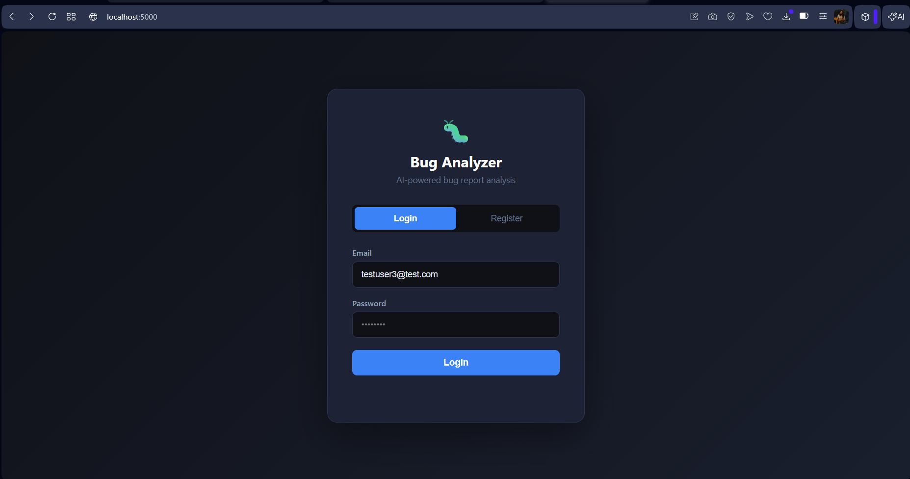
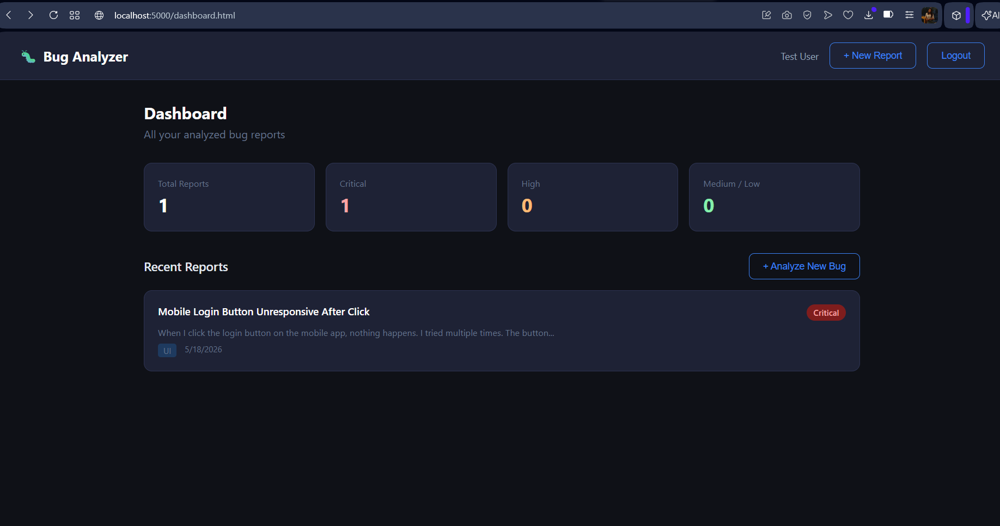
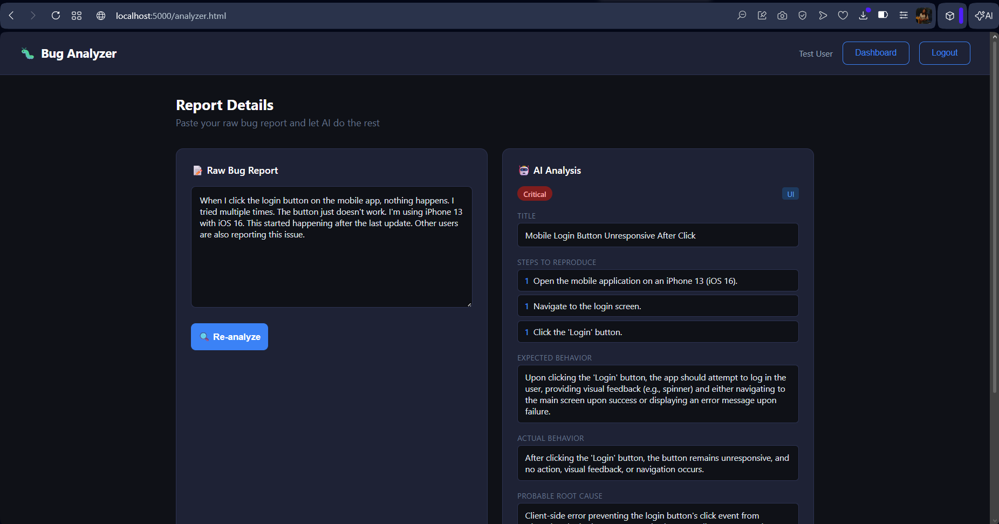

# AI Bug Report Analyzer

A full-stack web application that analyzes raw bug reports using AI and generates structured, actionable tickets automatically.

## Live Demo
Coming soon

## Problem It Solves
QA engineers often write inconsistent, unstructured bug reports. Developers waste time asking for clarification. This tool uses AI to instantly convert any raw bug report into a clean, standardized ticket.

## Tech Stack

- Frontend: HTML, CSS, JavaScript
- Backend: Node.js, Express.js
- Database: MongoDB Atlas
- AI: Google Gemini API
- Auth: JWT (JSON Web Tokens)
- Deployment: Railway

## Features

- User registration and login with JWT authentication
- Paste any raw bug report and receive an AI-generated structured ticket
- AI extracts title, severity, category, steps to reproduce, root cause, and suggested fix
- Dashboard showing all past reports with severity statistics
- Clean, responsive dark UI

## Screenshots

### Login


### Dashboard


### Analyzer


## Run Locally

1. Clone the repository

```bash
   git clone https://github.com/Chinitrivedi/bug-analyzer.git
   cd bug-analyzer
```

2. Install dependencies

```bash
   npm install
```

3. Create a `.env` file in the root directory

PORT=5000
MONGO_URI=your_mongodb_uri
JWT_SECRET=your_jwt_secret
GEMINI_API_KEY=your_gemini_api_key

4. Start the server

```bash
   npm run dev
```

5. Open `http://localhost:5000` in your browser

## Project Structure

```
bug-analyzer/
├── public/
│   ├── index.html
│   ├── dashboard.html
│   ├── analyzer.html
│   ├── css/
│   └── js/
├── src/
│   ├── config/
│   ├── controllers/
│   ├── middleware/
│   ├── models/
│   ├── routes/
│   ├── geminiService.js
│   └── index.js
└── package.json
```